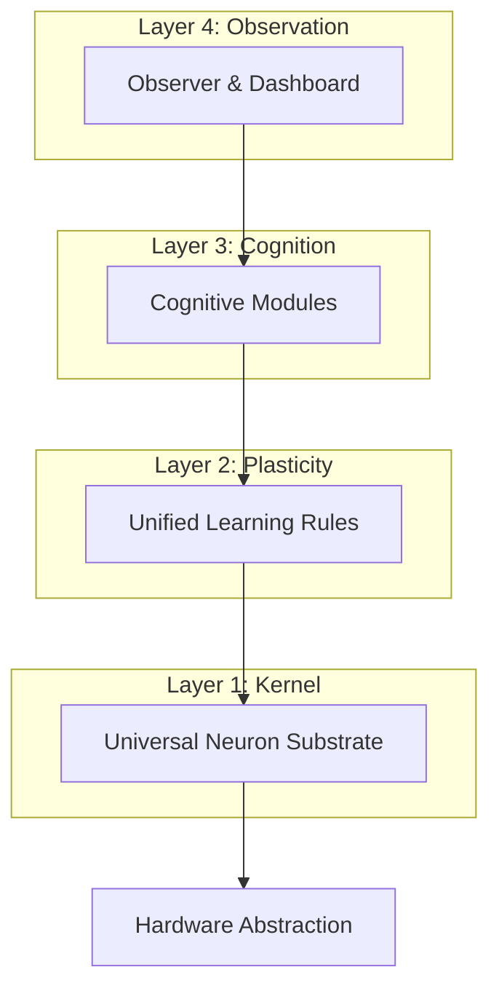

# **DORA ─Neuromorphic Research OS─**

**Neuromorphic Research OS(DORA)** は、知能をアルゴリズムとして「実装」するのではなく、複雑な神経活動のダイナミクスから創発する**現象として「観測」**するための、実験的かつ包括的な神経型計算基盤です。

本プロジェクトは、特定のタスク(画像分類など)のSOTA(最高精度)を競うものではありません。  
Forward-Forward、STDP、Active Inference といった局所学習則が、同一のスパイク神経基盤上でどのように相互作用し、そこから「意識」や「自己」のようなマクロな現象が立ち現れるかを探求するための**実験場(OS)**です。

## **🧭 Design Philosophy (基本哲学)**

私たちは、現代の深層学習(Backpropagation中心主義)とは異なるアプローチを採用しています。

### **1. 機能ではなく現象 (Phenomenon over Function)**

「意識」や「自由意志」をプログラムとして明示的に実装しません。それらは、大規模なネットワーク内の情報の統合(Integration)、放送(Broadcast)、競合(Competition)の結果として**観測される現象**として扱います。

### **2. 汎用的な神経基盤 (Universal Neural Substrate)**

視覚野には特徴抽出に優れた **Forward-Forward**、海馬には記憶形成に適した **STDP**、運動野には目的達成のための **Active Inference**。これら異なる学習則を持つモジュールが、**「スパイク」という共通言語**を通じて接続・連携できる基盤を提供します。

### **3. 時間発展としての知能 (Intelligence as Temporal Dynamics)**

静的な入出力写像ではなく、内部状態の**時間的な発展と履歴**を知能の本質と捉えます。睡眠(Sleep)、夢(Dreaming)、記憶の定着(Consolidation)は、システムの安定性と学習において重要な役割を果たします。

## **🏗 Architecture (アーキテクチャ)**

本OSは、ハードウェア抽象化層から高次認知機能まで、階層的に設計されています。



* **Layer 1: Universal Neuron Substrate**  
  * LIF (Leaky Integrate-and-Fire) ニューロンや多区画モデルをサポートするコアカーネル。  
* **Layer 2: Unified Learning Rules**  
  * Forward-Forward, STDP, Active Inference をプラグイン可能なモジュールとして提供。  
* **Layer 3: Cognitive Modules**  
  * Visual Cortex, Hippocampus, Global Workspace などの脳部位モジュール。  
* **Layer 4: Observation**  
  * 情報の統合量(Φ)、エントロピー、発火同期率をリアルタイムで可視化・計測。

## **📂 Directory Structure**

プロジェクトは「OS」としての構成に移行中です。

```
DORA/
├── app/                  # アプリケーション層 (Dashboard, API)
├── benchmarks/           # 安定性・性能評価ベンチマーク
├── configs/              # 実験・モデル設定ファイル (Hydra/OmegaConf)
├── doc/                  # 設計書・ロードマップ
├── scripts/              # 実行スクリプト群
│   ├── demos/            # 個別機能のデモ (Legacy/Comparison)
│   ├── experiments/      # 長期実験・学習スクリプト
│   └── runners/          # OSとしての統合実行ランナー
├── snn_research/         # コアライブラリ (The Kernel)
│   ├── core/             # ニューロン、ネットワーク基盤
│   ├── cognitive_architecture/ # 脳部位モジュール (GWS, Cortex...)
│   ├── training/         # 学習トレーナー (FF, STDP...)
│   └── visualization/    # 観測・可視化ツール
└── tests/                # ユニットテスト
```

## **🚀 Getting Started**

### **1. Installation**

```bash
# リポジトリのクローン
git clone https://github.com/matsushibadenki/SNN.git
cd SNN

# 依存関係のインストール (uv推奨)
uv pip install -r requirements.txt
# または
pip install -r requirements.txt

# ダッシュボードとAPIサーバーの起動
python -m app.main & python -m app.dashboard
```

### **2. Running the Visual Cortex Demo (Forward-Forward)**

現在、最も安定して動作する視覚野モジュール(Forward-Forward学習)のデモです。

```bash
python scripts/demos/visual/run_spiking_ff_demo.py
```

### **3. Stability Benchmark (New)**

システムの学習安定性を検証するためのベンチマークです。
`VisualCortex` モデルの学習安定性が 95% を超えることを目標としています。

```bash
python benchmarks/stability_benchmark_v2.py --runs 5 --epochs 5
```

### **4. Exploring the "Phenomenon"**

意識の萌芽を観測するための統合シミュレーション(開発中):

```bash
# 今後のアップデートで実装予定
# python scripts/runners/run_neuromorphic_os.py
```

## **🗺 Roadmap**

詳細は [doc/ROADMAP.md](doc/ROADMAP.md) を参照してください。

* **Phase 1**: コアエンジンの統一と安定性 (Universal Substrate & Stability)
  * Target: Learning Stability > 95%
* **Phase 2**: ハイブリッド実験場の構築 (FF + STDP + Active Inference)
* **Phase 3**: 観測システムの構築 (意識・クオリアの観測)
* **Phase 4**: ハードウェア連携と大規模シミュレーション

## **🤝 Contribution**

Neuromorphic Research OS(DORA) は、神経科学、認知科学、AI研究の交差点にあるオープンな実験場です。  
新しい学習則の実装、脳部位モジュールの追加、観測ツールの開発など、あらゆる貢献を歓迎します。

## **📜 License**

[MIT License](LICENSE)