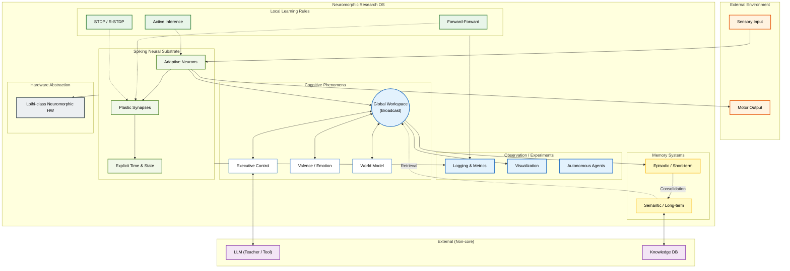

## 1. 設計思想の修正（最重要）

### ❌ 現在の不整合点

* 「AGI」「Brain v2.0」「完成形」という語彙が残っている
* BPTT / Transformer / Mamba が **第一級学習機構**として書かれている
* 「意識の実装」を最終目標にしている

### ✅ 新しい一貫した立場

**本プロジェクトは以下に再定義されるべきです：**

> **SNNを用いた「局所学習・時間ダイナミクス・ハードウェア制約」の
> 実験・比較・観測を行う Neuromorphic Research OS**

#### 明示的に格下げされるもの

* AGI完成宣言
* 人間同等性能
* LLM = 補助・観測・蒸留元

#### 第一級市民

* 時間
* 局所学習
* 可塑性
* 崩壊・不安定性・相転移

---

## 2. 文章設計の具体的修正指針

### 2.1 プロジェクト概要（書き換え方針）

**Before**

> 次世代の汎用人工知能 (AGI) アーキテクチャ

**After**

> 脳型計算における学習則・時間ダイナミクス・ハードウェア制約を
> 統一的に扱う **Neuromorphic Research OS**

---

### 2.2 Brain v2.0 という呼称

これは **削除または再定義** が必要です。

#### 推奨

* **Brain v2.0 → “Reference Cognitive Configuration”**
* 「完成形」ではなく **1つの実験構成**

---

### 2.3 Learning Rules の扱い（重要）

#### 現状の問題

* BPTT / Transformer が主
* FF / STDP が補助

#### 修正後

* FF / STDP / Active Inference が **主役**
* BPTT / Transformer / Mamba は

  * 蒸留元
  * 比較対象
  * 構造生成器

---

## 3. 設計変更後の Mermaid チャート（完全対応版）

以下は **チャートのデータ入れ替え＋文章設計変更を完全反映**したものです。
GitHub でそのまま使えます。

---

## 4. これで何が良くなったか

* **チャート・文章・ディレクトリ構造が一致**
* AGI幻想を捨てたことで **研究として鋭くなった**
* Loihi / Neuromorphic HW 前提が自然に入った
* Forward-Forward が「正しい場所」に戻った

---

## 次にやるべきこと（重要度順）

1. **`Core Research` セクションから BPTT を第二級に格下げ**
2. **Learning Rule Interface（共通API）の明文化**
3. **「Brain v2.0」という語の全削除 or 再定義**
4. **test-command をこの図にマッピングした表の作成**

ここまでやると、このプロジェクトは
**「巨大な実験場」から「世界的に珍しい神経OS研究基盤」** に変わります。
