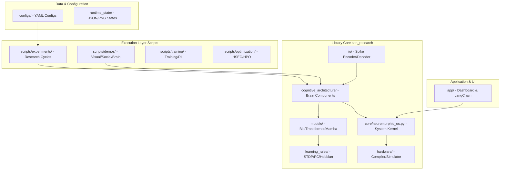

# SNN Project Structure (最新版)

本ドキュメントは、Spiking Neural Network (SNN) 研究プロジェクトの最新のディレクトリ構造と各モジュールの役割を定義します。

---

## プロジェクト・アーキテクチャ概要

本プロジェクトは、脳型計算（Neuromorphic Computing）をシミュレートするための階層型アーキテクチャを採用しており、大きく分けて「ライブラリ・コア」「実行レイヤー」「アプリケーション・インターフェース」の3層で構成されています。



---

## ディレクトリ詳細

### 1. `snn_research/` (コアライブラリ)

プロジェクトの核となるロジック。脳の機能を模したモジュール群が含まれます。

- **`cognitive_architecture/`**: 人工脳の構成要素（Hippocampus, Thalamus, Amygdala, Global Workspace等）
- **`core/`**: 低レイヤのインフラ
  - `neuromorphic_os.py`: スケジューリング、リソース管理、割り込み処理を担当
  - `layers/`: LIF, DSA, BitSpike, Thermodynamic等の特殊レイヤ
  - `networks/`: 基本的なネットワーク構成（Sequential, Bio-PC等）
- **`models/`**: 具体的なモデルアーキテクチャ
  - `bio/`: 生物学的に妥当なモデル
  - `transformer/`: Spikformer, Spiking Transformer等
  - `experimental/`: Mamba, Diffusion, MoEなどの最新研究
- **`learning_rules/`**: 学習規則の定義（STDP, Predictive Coding, Forward-Forward等）
- **`distillation/`**: 知識蒸留（Knowledge Distillation）の管理機能
- **`evolution/`**: 構造的可塑性や再帰的な自己改善ロジック
- **`hardware/`**: ハードウェアコンパイラ、イベント駆動シミュレータ、HDLテンプレート
- **`io/`**: 感覚受容器（Sensory Receptor）とスパイク符号化・復号化

### 2. `scripts/` (実行・研究レイヤー)

ライブラリを使用して実験や訓練を行うためのスクリプト群。

- **`experiments/`**: 特定の仮説検証（scal, systems, social, brain 等）
- **`demos/`**: 視覚認知、社会性、脳機能などの統合デモ
- **`training/`**: 学習実行スクリプト。`trainers/` 内に多様な学習戦略を保持
- **`optimization/`**: HSEO（Hyper-parameter Search via Evolution）やOptunaによる最適化
- **`visualization/`**: 脳活動のプロットや思考プロセスの可視化（Dashboard連携）

### 3. `app/` (アプリケーション層)

ユーザーインターフェースおよび外部連携。

- **`dashboard.py`**: Streamlitベースのリアルタイム脳活動モニタリング
- **`adapters/`**: LangChainアダプター等、外部LLMエコシステムとの連携

### 4. `configs/` (設定ファイル)

実験、モデル、検証ターゲットごとのYAML設定。

- **`models/`**: 各モデルのパラメータ
- **`experiments/`**: 実行シナリオの設定

---

## データフロー

1. **感覚入力**: `snn_research/io` が外部データ（Image, Text, Signal）をスパイク列に変換
2. **知覚処理**: `snn_research/core/layers` および `snn_research/models` がスパイクを処理
3. **認知的統制**: `snn_research/core/neuromorphic_os` が各モジュールの実行タイミングと注意（Attention）を制御
4. **学習・可塑性**: `snn_research/learning_rules` により実行中に重みや構造が変化
5. **出力・行動**: `snn_research/io/actuator` がスパイクを外部コマンドやデータに復号
6. **状態保存**: `runtime_state/` に現在の脳の状態や実験結果が保存される

---

## ディレクトリツリー例

```
SNNproject/
├── snn_research/
│   ├── cognitive_architecture/
│   │   ├── hippocampus.py
│   │   ├── thalamus.py
│   │   └── global_workspace.py
│   ├── core/
│   │   ├── neuromorphic_os.py
│   │   ├── layers/
│   │   └── networks/
│   ├── models/
│   │   ├── bio/
│   │   ├── transformer/
│   │   └── experimental/
│   ├── learning_rules/
│   ├── distillation/
│   ├── evolution/
│   ├── hardware/
│   └── io/
├── scripts/
│   ├── experiments/
│   ├── demos/
│   ├── training/
│   ├── optimization/
│   └── visualization/
├── app/
│   ├── dashboard.py
│   └── adapters/
├── configs/
│   ├── models/
│   └── experiments/
└── runtime_state/
```

---

## 技術スタック

- **フレームワーク**: PyTorch, SNNTorch
- **可視化**: Streamlit, Matplotlib
- **最適化**: Optuna
- **言語モデル連携**: LangChain
- **ハードウェア**: カスタムコンパイラ、イベント駆動シミュレータ

---

## 開発・実験ワークフロー

1. **設定**: `configs/` でYAMLファイルを編集
2. **実験実行**: `scripts/experiments/` または `scripts/training/` でスクリプトを実行
3. **結果確認**: `app/dashboard.py` でリアルタイム監視
4. **状態保存**: `runtime_state/` に自動保存
5. **最適化**: `scripts/optimization/` でハイパーパラメータ調整

---

## ライセンス

(プロジェクトのライセンス情報をここに記載)

---

**Contact**: (連絡先情報)
